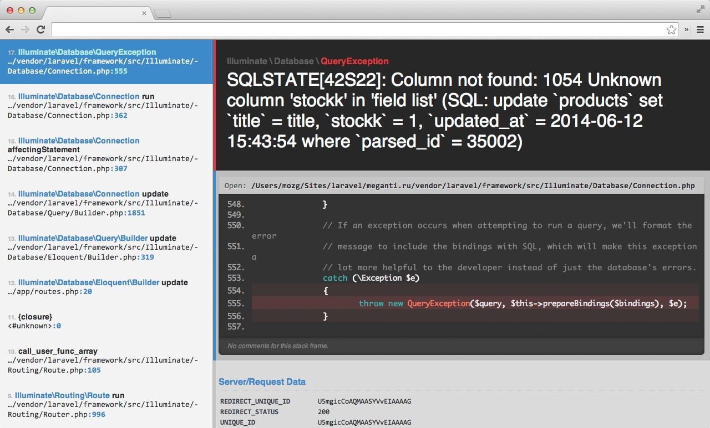
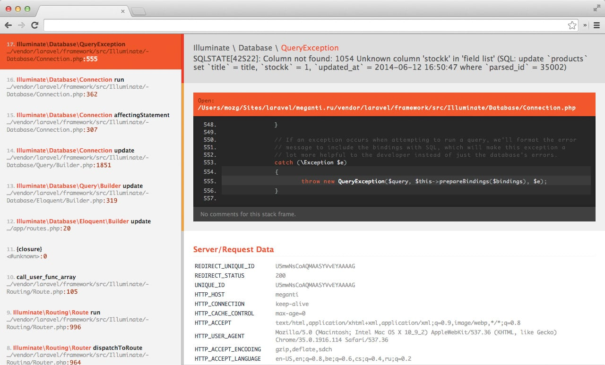

whoops-orange-laravel-colors
============================

Laravel uses [Whoops package](https://github.com/filp/whoops "Whoops package") for various error messages. For a long time, the package was used with a custom color-scheme by [Dayle Rees](https://twitter.com/daylerees "Dayle Rees").  
Newer versions of Laravel (from 4.2) use the latest Whoops version and default color-scheme, the grey and blue one,
to avoid various errors with the next updates of Whoops.

For everyone, who liked the orange theme (the colors, fonts, font-sizes, etc.) - here it is.

## Installation
Simply copy the css file to that vendor folder in your laravel directory, according to your whoops version:
~~~
vendor/filp/whoops/src/Whoops/Resources/css/
~~~

### The difference
#### Default

#### Old (orange)

